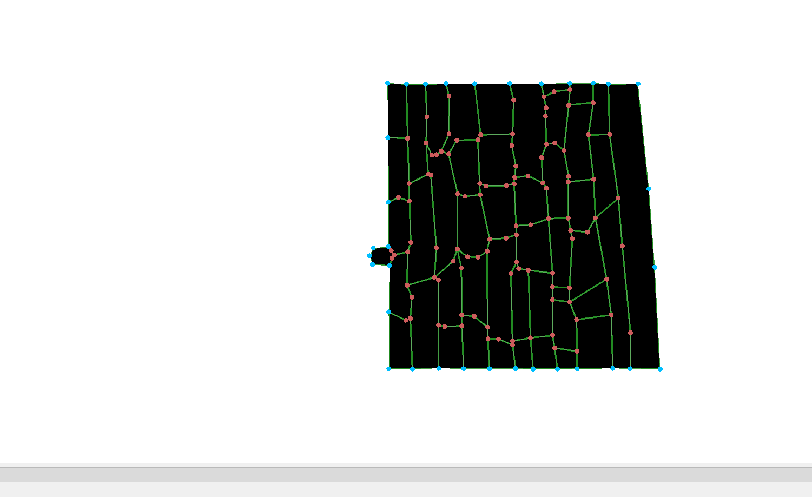
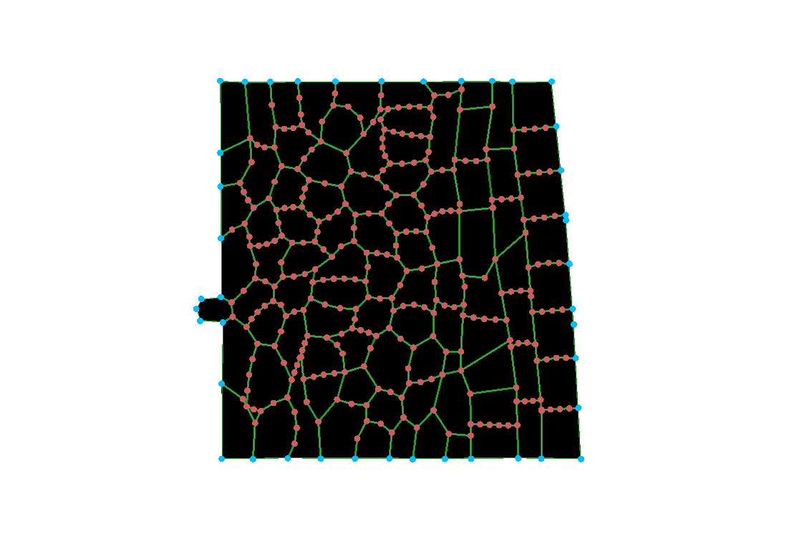
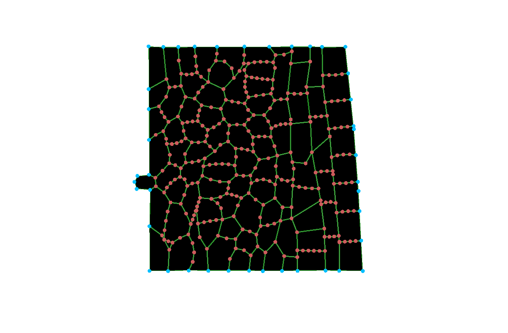
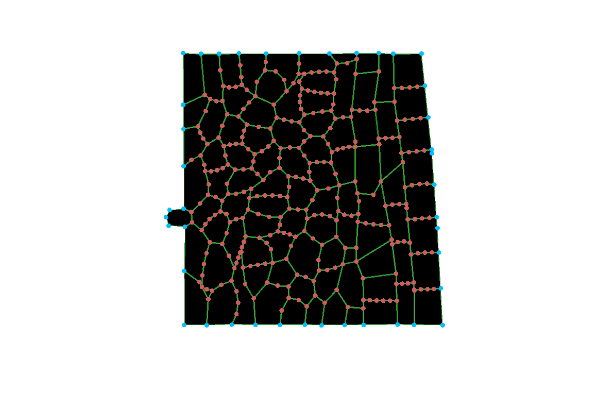
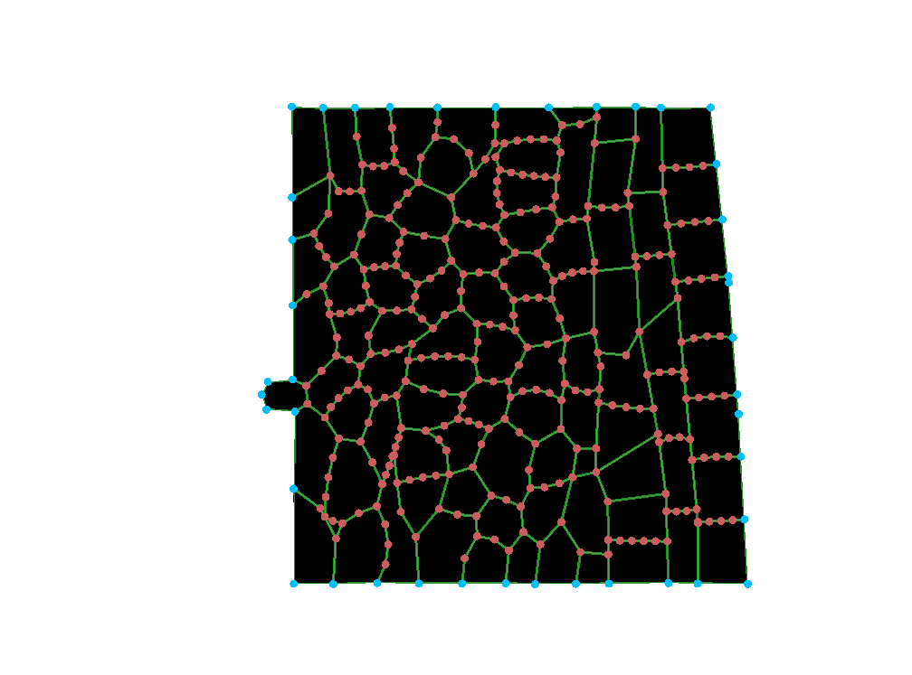
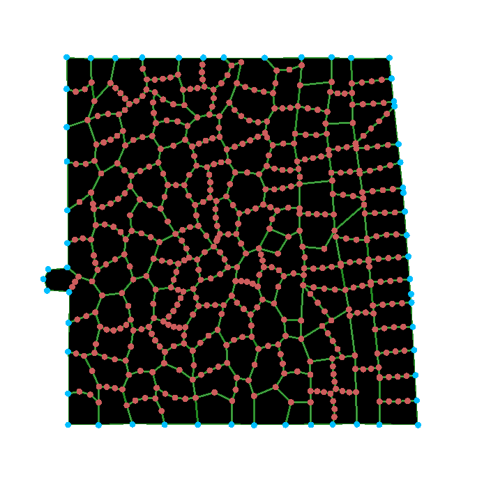
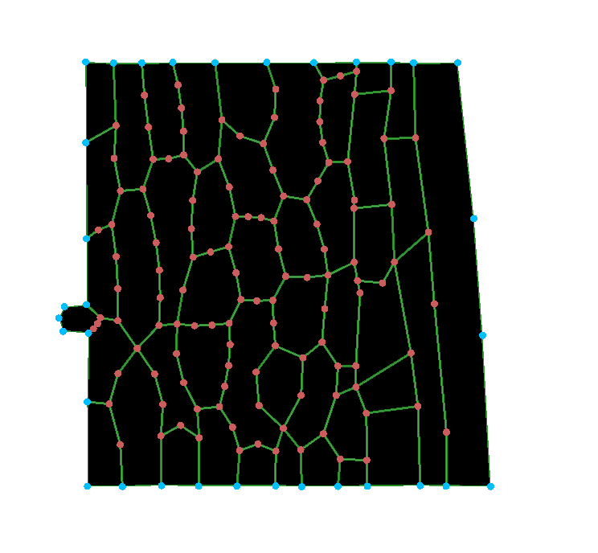

# Plant Tissue Simulations

**Course:** KEN3170 – Multi-scale Modeling of Biological Systems  
**Group:** 02

---

## 1. Pathogen Infection Simulation

The `pathogen_infection` model was simulated for a total duration of 2 hours.
Screenshots were taken at the initial state and every 30 minutes.

### 1.1 Simulation Progression

#### 0 minutes


Observation: The healthy tissue starts out as a neat, organized grid of rectangular cells. The pathogen is just a small spot on the left edge.

#### 30 minutes


Observation: The tissue deforms quickly. The cells lose their rigid shape and become swollen and round, causing the whole block of tissue to bulge outward.

#### 60 minutes


Observation: The deformation increases. The tissue reaches a new, stable state that looks almost the same as it did at 30 minutes.

#### 90 minutes


Observation: No big changes. The tissue stays in this degraded state.

#### 120 minutes


Observation: The simulation ends with the tissue  disorganized and swollen.

### 1.2 Overall Observations

The infection starts from the small pathogen region on the left side of the tissue and spreads outwards from there by releasing chemicals that attack and weaken the plant's cell walls. In the model, this spread works by lowering the stiffness parameter of the cell walls as the pathogen moves through the grid. 
The tissue doesn't keep its neat shape like in a healthy plant, because there would be a perfect balance between the pressure pushing outward from inside the cell and the walls that hold everything in place. When the pathogen's chemicals break down that wall stiffness, the cells can’t resist the internal pressure anymore. Because the turgor pressure keeps pushing against walls that are now too weak to push back, the cells rapidly deform.  They swell into rounded, irregular shapes, making the whole outer edge of the tissue bulge. This structural collapse goes through the entire grid in the first 30 minutes, leaving the tissue disorganized for the rest of the run. 


## 2. Cell Wall Stiffness

### Normal Cells

For normal cells, the wall stiffness decreases as the chemical level increases. The code first takes the chemical level and scales it by dividing it by 0.5. If this scaled value is above 0.1, the cell wall starts to weaken. The normal stiffness value is 3, and the scaled chemical level is subtracted from this value, so a higher chemical level means a lower wall stiffness. The chemical effect is limited to a maximum value of 1.2, which means the stiffness cannot decrease below 1.8. So overall, the more chemical reaches a normal cell, the softer its wall becomes.

### Pathogen Cells

Pathogen cells are treated differently because the wall weakening rule does not apply to them. The code only reduces stiffness when the cell is not a pathogen (CellType != 2). Because of this, pathogen cells keep the default stiffness value of 3 even when the chemical level is high. So the chemical mainly weakens the surrounding plant cells, while the pathogen itself keeps its wall stiffness unchanged. 

---

## 3. Cell-to-Cell Transport and Feedback

### Diffusion Coefficient

Diffusion is the passive movement of chemical between neighbouring cells, with the net flow going from high to low concentration. The diffusion coefficient decides how fast this happens, and it depends on how stiff that wall is in the CelltoCellTransport, the diffusion coefficient is defined by: diffusionCoef = 0.00001 / stiffness
This means a stiff wall gives a small diffusion coefficient, so the chemical moves slowly. A soft wall gives a larger diffusion coefficient, so the chemical moves faster. In other words, the softer the wall, the faster the chemical spreads.

#### Feedback Loop

1. The pathogen keeps making the chemical.
2. The chemical moves into the neighbouring cells.
3. In those cells, the chemical makes the walls softer (in `CellHouseKeeping`, the stiffness drops from 3 to `3 - chemical level`).
4. Softer walls let the chemical pass through faster (the diffusion coefficient is `0.00001 / stiffness`, so a lower stiffness gives a higher value).
5. Because the chemical now moves faster, it reaches the next cells sooner. Their walls also become softer, and the whole thing repeats.

### Feedback Diagram

```
        More chemical in a cell
                 │
                 │  makes the walls softer
                 ▼
          Softer cell walls
                 │
                 │  lets the chemical pass faster
                 ▼
          Faster diffusion
                 │
                 │  spreads the chemical to neighbours
                 ▼
       More chemical in neighbours
                 │
                 └──────► back to the top
```

### Type of Feedback

Each round makes the next one stronger, so it's positive feedback, and that's why the infection keeps spreading.

The feedback does have limits. The walls can never become softer than a stiffness of 1.8, so the chemical can only speed up to a certain point. The cells also slowly break down the chemical, so far away from the pathogen it does not build up enough to soften the walls.


---

## 4. Effect of `rel_cell_div_threshold`

Two simulations were performed using different values of `rel_cell_div_threshold`.

default value: 2

### Run 1 – Lower Threshold

Value: 1.2

Observation:
With a lower threshold, cells divide at a smaller size. This lets the pathogen multiply quickly, packing the tissue with tiny cells and spreading the infection fast.

### Run 2 – Higher Threshold

Value: 20

Observation:
A high threshold forces cells to grow big before they can divide. The pathogen gets stuck because it cannot multiply, and the original cells just swell up instead of splitting.

### Comparison

The threshold controls exactly how big a cell must be to divide. A lower value speeds up the infection because the pathogen multiplies rapidly, and a high value stalls the spread by trapping the pathogen in a few swollen cells that cannot divide.

---

## 5. Cell Neighbours

In the previous models, all cells were plant cells, and their neighbours were other plant cells from the same tissue.

In the infection model, cells can have a neighbour that is not part of the plant: the pathogen. The pathogen grows and divides inside the tissue (`EnlargeTargetArea` and `Divide` for cell type 2), so the plant cells around it keep getting new pathogen neighbours, while they are pushed aside and squeezed. The plant cells do not turn into pathogen cells; the pathogen spreads by growing into the tissue. Being next to the pathogen also changes the plant cell, because the chemical it receives from its neighbours softens its walls.

---

## 6. Proposed Plant Defense Mechanism

### Pseudocode

The defense would be added in the same part of `CellHouseKeeping` where the chemical level is checked and the wall stiffness is changed. 


```
calculate chemical level
set normal wall stiffness

if cell is not a pathogen:
    if chemical > defense threshold:
        increase wall stiffness
    else if chemical > weakening threshold:
        decrease wall stiffness
    else:
        keep normal wall stiffness

apply stiffness to the wall
```

So basically, the new condition would be added before the original weakening rule. If the chemical level becomes high enough to activate the defense, the cell would stiffen its wall. If the defense threshold is not reached, the cell would continue following the original rule, where increasing chemical makes the wall weaker.

### Feedback
This defense would add negative feedback. In the original model, more chemical makes the wall less stiff, and a lower stiffness increases the diffusion coefficient, which helps the chemical spread further. With the defense, once the chemical level becomes high enough, the cell reacts in the opposite way and makes its wall stiffer. Since the diffusion coefficient decreases when stiffness increases, this would slow down the spread of the chemical to neighbouring cells. 

more chemical
→ defense is activated
→ wall becomes stiffer
→ diffusion decreases
→ chemical spreads more slowly